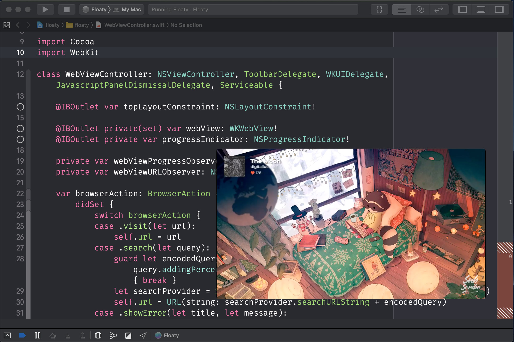

# floaty

[](https://travis-ci.org/jameszaghini/floaty)
[](https://codecov.io/gh/jameszaghini/floaty)
[](https://codeclimate.com/github/jameszaghini/floaty/maintainability)


A browser window that floats on top of other application windows.

Floaty presents Youtube, Vimeo & Twitch videos using the entire window, while hiding the window controls so you can watch a video while you work or play.



## Installing floaty

floaty is available for direct download on the [releases page](https://github.com/jameszaghini/floaty/releases) or using [homebrew cask](https://github.com/caskroom/homebrew-cask).

```
brew cask install https://raw.githubusercontent.com/jameszaghini/floaty/develop/floaty.rb
```

## Building floaty

Install Xcode 10.2, then clone & open the project:

```
git clone https://github.com/jameszaghini/floaty.git && cd floaty && xed .
```

Press build. You're done!
